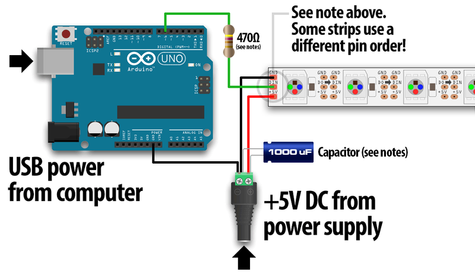

# Beginner's Installation
## About
This Installation-Guide will provide you with information for setting up your own led-piano with no experience in programming or whatsoever. You simply need time and patience. I take no warranty for any damage in this process or that the project won't work for you.

## Notice
Please notice that I can't replicate the entire steps given since I don't have the hardware to do it again. This guide may provide images but not for all steps shown.

## What you need
- A standard piano with 88 keys. Depending on what led-strip you will actually use you can have a piano with more or less keys.
- Your piano should have a USB-MIDI-Interace. If your piano doesn't have a USB-MIDI-Interface you can get a [MIDI-to-USB-cable](https://www.thomann.de/de/thomann_midi_usb_1x1.htm).
- An APA102 (Dotstar) LED-Strip. I used 144 LEDs/0.5m, but you can go with any length you want. Notice that the LEDs should match the keys.
- A Raspberry Pi version 3 or higher.
- A micro-sd card with atleast 16 GB of storage.
- A power supply for your raspberry pi
- A USB-to-HOST-cable like [this](https://www.thomann.de/de/lindy_usb_2.0_typ_a_b_5m_black.htm) one.
- 4 Female-to-Female wires
- **For use with the background-led-funtion**: A 5V 10A power supply for your strip (144 LEDs/0.5m). If you are unsure what power supply you need: 
    - Expect each LED consumes up to 60mA. Then use this function to calculate your needed power supply: strip-led-length * 60 mA / 1000 = Amps 
    - With that in mind you need to search for a power supply of 5V and your calculated amps. 
    - For more information on additional materials refer to the [wiring-guide](#background-led-wiring)

## Installing Raspbian
I recommend using the official installation [tutorial](https://projects.raspberrypi.org/en/projects/raspberry-pi-setting-up) for installing raspbian on your raspberry pi.

## On Raspbian
If you booted into raspbian successfully you need to get some packages before starting. Some of these packages might be already installed on your system. Open up a terminal and type in following commands:
```
sudo apt-get update
sudo apt install curl
sudo apt-get install nodejs
curl -L https://npmjs.org/install.sh | sudo.sh
sudo apt install python3
sudo apt install gcc
sudo apt install g++
sudo apt install libasound2-dev
```
If you're done installing verify the nodejs-package with those two commands:
```
node -v
npm -v
```
The outputs for `node -v` should be v10.15.2 or higher and for `npm -v` 5.8.0 or higher

## Copying the Project
Navigate into any directory you want to install this project. I recommend using the `documents` folder. Download the project into your directory using `git clone https://github.com/SchnoppDog/piano-led.git`. After your download change into the newly created directory called led piano. Now use the command `npm install` to install the project with its modules.

## Setting Variables
Now comes a more tricky part of this installation-guide, but don't worry.

### Creating and updating mainConfig.js
First open the file called `mainConfig.txt`. Copy the text and close the file again. Navigate to `backend` and create a new file called `config.js`. Open up `config.js` and paste your copied text. Change the `config.server.port` to `8080` 
```
config.server.port = 8080
```
Then change the `config.server.ipPi` to your rapsberry pi's IPv4-adress. If you don't know how to obtain the ipv4-adress of your rapsberry pi simply type `ifoncfig | grep inet` into the terminal. The output should be like this:
```
inet 192.168.0.0  netmask 255.255.255.0  broadcast 192.168.0.255
```
Copy your inet number (in this example 192.168.0.0) and paste it into the `config.server.ipPi` variable:
```
config.server.ipPi = "192.168.0.0"
```
Quotation marks are need.

### Piano-Variables
Now connect your piano with a USB-to-Host cable to your raspberry-pi and turn it on. To verify that you piano is detected as MIDI-Device open up a terminal and type in `aconnect -i`. Your piano should be listed something like:
```
client 20: 'Digital Piano' [type=Kernel,card=1]
    0 'Digital Piano MIDI 1'
```
After verifying that your piano is listed with this command use the `yourPianoName.js`-file in `/backend/lib/test`. Open the JavaScript-File with this command: `node yourPianoName.js`. The **first** output should be like this:
```
Midi Through:Midi Through Port-0 14:0,Digital Piano:Digital Piano MIDI 1 20:0
```
Copy your piano name (in this example `Digital Piano:Digital Piano MIDI 1 20:0`) and paste is somewhere safe so you can access it again.
The **second** output you get should be like this:
```
locationId: 0,
   vendorId: 1177,
   productId: 5647,
   deviceName: 'Digital Piano',
   manufacturer: 'Yamaha Corporation',
   serialNumber: '',
   deviceAddress: 0 
```
Copy your device after the `deviceName`-variable and open up `main.js` in folder `/backend`. Scroll down until you see this:
```
usbDetect.startMonitoring()
usbDetect.on('add',(device) => { 
    if(device.deviceName === "Digital_Piano")
```
Replace in this if-statemant the `Digital_Piano` with your saved value (the value you copied in the second step). In this if-statemant you should also see this:
```
const midiInput = new pianoMidi.Input('Digital Piano:Digital Piano MIDI 1 20:0')
``` 
Replace `Digital Piano:Digital Piano MIDI 1 20:0` with your stored value from step one. **After changing these files don't forget to save them!**

## Installing PM2
Now you are nearly done! All you need is to put the `main.js`-file into startup using pm2. This is used to make sure your script is running even if the pi unexpectedly shuts down or needs to be restarted. To install pm2 simply navigate into the root-directory and type `npm install pm2 -g`. After the installation navigate to `/backend` and run this command: `pm2 start ecosystem.config.js`. Your output should be like this:
```
LED-Piano    │ default     │ 1.0.2   │ cluster │ 23556    │ 14h    │ 1    │ online    │ 2.6%     │ 49.9mb   │ pi       │ disabled 
```

## Enable SPI
To use this application you need to activate SPI. To do that go into your pi's `settings` and click on `raspberry-pi-configuration`. Then you navigate to `interfaces` and activate SPI. Close the window with OK. 

## Wiring your strip
If you want to use the background-led-function and you have the needed power supply then follow [these steps](#background-led-wiring) to wire up your strip with the power supply and the raspberry pi. If you don't want to use this function or don't have the needed power supply then follow [these steps](#normal-wiring) to wire up your strip to your raspberry pi.

### Normal-Wiring
To wire up your strip you need four female-to-female wires:
- One for GND (Ground). Color is often black.
- One for 5V. Color is often red.
- One for DATA. Color is often green.
- One for Clock-Rate. Color is often blue  
  
Now you need to connect all four wires to each correspondending color on the strip. After connecting the wires to the strip you need to connect them to the raspberry pi too. The pins needed for raspberry pi version 3 can be reviewed with this [pinout](https://pinout.xyz).
Simply connect GND to GND, 5V to 5V, Clock-Rate to Pin 23 (SCLK) and DATA to Pin 19 (MOSI) on your pi.

### Background-LED-Wiring
To wire up your strip you need these additional materials:
- 1x 1000 micro Farad 6.3V capacitor
- 1x 330 ohm resistor or better 1x 470 ohm resistor
- Maybe a breadboard
- Depending on what external power supply you use you might need one of these: [DC Barrel Jack Adapter](https://www.amazon.de/DC-Barrel-Jack-Adapter-Stecker/dp/B007XEXBS4)
- Some more Wires (Male-to-Male, Female-to-Female, Male-to-Female)



#### 1. Connect some wires to your strip
- One for GND (Ground). Color is often black.
- One for 5V. Color is often red.
- One for DATA. Color is often green.
- One for Clock-Rate. Color is often blue 

#### 2. Connect some wires to your raspberry pi
Use this [pinout](https://pinout.xyz) for connecting your wires to a raspberry pi version 3. Simple connect:
- One wire for GND
- One wire for 5V
- One wire for DATA Pin 19 (MOSI)
- One wire for Clock-Rate Pin 23 (SCLK)

#### 3. Connecting the power supply with your pi and strip
Using the image above you need to:
- Place a resistor (330/470 ohm) between your pis and strips DATA-connection. This protects your first led from damaging itself due to onrushing current.
- Connect the capacitor to GND and 5V of your power supply (or barrel)
- Connect the GND of the strip and the raspberry pi to the GND of the power supply (minus-pole). Notice that the capacitor needs to receive the incoming current from the power supply first.
- Connect +5V from your power supply with the led-strip.

## Finish
Now you should be good to go. Plug in your power-supply for the raspberry pi, turn it and your piano on and have fun! To change colors simply visit the following website `http://your_pi_ip_address:your_port/color-page` in any browser you like.  
**If you have any problems you can contact me. But please keep in mind that this project was never intended to be public so errors and problems can rise.**