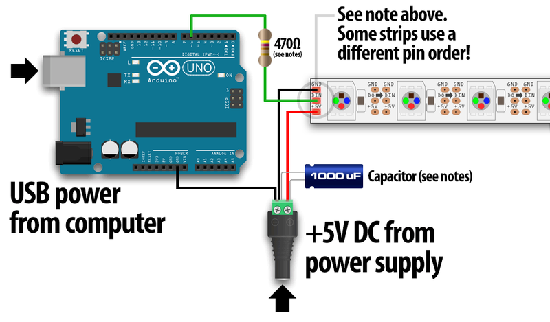

# piano-led


## About
This is a selfmade project inspired by videos from pianist Rousseau on Youtube. With this project you can light up your piano just like rousseau and other people. This project is entirely written in Node.js and a bit of HTML. I take no warranties that the project works for you.

## IMPORTANT NOTICE
Please read the newest [changelog](.github/readme_files/UPDATES.md) (.github/readme_files/UPDATES.md) if you want to know more about the future of this project!

## General Information
There are several Readme-Files for different purposes:
- Are you a beginner and have no experience in Linux, NodeJS or whatsoever? Click on this [Beginner's-Guide](.github/readme_files/BEGINNER.md)
- You do have some knowledge about Linux and or NodeJs? Go to the normal [Installation-Guide](#installation) in this file.
- If you're interested in recent Updates just follow this [Update-File](.github/readme_files/UPDATES.md)

# Installation
## About
This installation-guide will provide you with information for setting up your own led-piano. I take no warranty for any damage in this process, loss of data or that the project won't work for you. 

## What you need
- A standard piano with 88 keys. Depending on what led-strip you will actually use you can have a piano with more or less keys.
- Your piano should have a USB-MIDI-Interace. If your piano doesn't have a USB-MIDI-Interface you can get a [MIDI-to-USB-cable](https://www.thomann.de/de/thomann_midi_usb_1x1.htm).
- An APA102 (Dotstar) LED-Strip. I used 144 LEDs/0.5m, but you can go with any length you want. Keep in mind that the LEDs should match the keys.
- A raspberry pi (version 3 or higher).
- A micro-sd card with atleast 16GB of storage.
- A Power-Supply for your raspberry-pi.
- A [USB-to-HOST-cable](https://www.thomann.de/de/lindy_usb_2.0_typ_a_b_5m_black.htm).
- A bit of knowledge about node.js and linux.
- **For use with the background-led-funtion:** A 5V 10A power supply for your strip (144 LEDs/0.5m). If you are unsure what power supply you need:
    - Expect each LED consumes up to 60mA. Then use this function to calculate your needed power supply: strip-led-length * 60 mA / 1000 = Amps
    - With that in mind you need to search for a power supply of 5V and your calculated amps.
    - For more information on additional materials refer to the [wiring-guide](#background-led-wiring)

## Software-Preparations
I recommend using the official installation [tutorial](https://projects.raspberrypi.org/en/projects/raspberry-pi-setting-up) for installing raspbian on your raspberry pi.
## On Raspbian
If you booted into raspbian successfully you need to get some packages before starting. Some of these packages might be already installed on your system. Open up a terminal and type in following commands:
```
sudo apt-get update && apt-get upgrade
sudo apt install curl
sudo apt-get install nodejs
sudo apt-get install npm
sudo apt install python3
sudo apt install gcc
sudo apt install g++
sudo apt install libasound2-dev
sudo apt-get install libudev-dev
```
If you're done installing verify the nodejs-package with those two commands:
```
node -v
npm -v
```
The outputs for `node -v` should be v10.15.2 or higher and for `npm -v` 5.8.0 or higher

## Copying the Project
Navigate into any directory you want to install this project. I recommend using the `documents` folder. Download the project into your directory using `git clone https://github.com/SchnoppDog/piano-led.git`. After your download change into the newly created directory called led piano. Delete the `package-lock.json` file. Now use the command `npm install` to install the project with its modules.

## Updating variables
### Creating and Updating config.js
Rename the file called `mainConfig.txt` to `config.js` in the `backend` directory. Open the `config.js` file and change `config.server.port` to `8080`. After that change `config.server.ipPi` to your pis ipv4-address. This should look like this example:
```
config.server.ipPi = "192.168.0.0"
```
**Important:** Quotation-marks need to be set!

### Piano-Variables
User the file `yourPianoName.js` in folder `backend/lib/test` to list your piano-name and device-name. Change the directory to `backend/lib/test` and simply type `node yourPianoName.js` into the terminal. The **first** output you get should be something like:
```
Midi Through:Midi Through Port-0 14:0,Digital Piano:Digital Piano MIDI 1 20:0
```
Copy your piano-name, in this example `Digital Piano:Digital Piano MIDI 1 20:0` and paste it somewhere save.
The **second** output you get should be a list of different devices. Search your piano until you find something like this:
```
 locationId: 0,
    vendorId: 1177,
    productId: 5647,
    deviceName: 'Digital Piano',
    manufacturer: 'Yamaha Corporation',
    serialNumber: '',
    deviceAddress: 0 
```
Copy your device after the `deviceName`-variable and open up `main.js` in folder `/backend`. Scroll down until you see this:
```
usbDetect.startMonitoring()
usbDetect.on('add',(device) => { 
    if(device.deviceName === "Digital_Piano")
```
Replace the `Digital_Piano` with your recently copied value. In this if-statemant you should also see this:
```
piano = new pianoMidi.Input('Digital Piano:Digital Piano MIDI 1 24:0')
```
Replace `Digital Piano:Digital Piano MIDI 1 20:0` with your stored value from step one.

### Use http-server instead of https
In my network I secured the website by using self-signed certificates, which **is not mandatory**. Chances are you don't have a valid certificate or a self-signed certificate for this applications web GUI. In order to make the application work you need to comment these code lines in `main.js` (should be near the top of the file): 

```javascript
const privKey           = fs.readFileSync('/usr/local/certs/keys/pianoled.local.pem')
const pubKey            = fs.readFileSync('/usr/local/certs/pianoled.local.pem')
```

And:

```javascript
const pianoServer       = require('https').createServer({
    key: privKey,
    cert: pubKey
}, colorApp)
```

Then un-comment the following code line:

```javascript
const pianoServer       = require('http').createServer(colorApp)
```

If you want to use this applications website GUI over ssl you can simply create self-signed certificates. You can find many tutorials in the web or just use the [README](.github/readme_files/Create_SSL_Certs.md) in `.github/readme_files/Create_SSL_Certs.md`. **After changing these files don't forget to save them!**

## Installing PM2
Now you are nearly done! All you need is to put the `main.js`-file into startup using pm2. This is used to make sure your script is running even if the pi unexpectedly shuts down or needs to be restarted. To install pm2 simply navigate into the root-directory and type `sudo npm install pm2 -g`. After the installation navigate to `/backend` and run this command: `pm2 start ecosystem.config.js`. Your output should be like this:
```
LED-Piano    │ default     │ 1.0.2   │ cluster │ 23556    │ 14h    │ 1    │ online    │ 2.6%     │ 49.9mb   │ pi       │ disabled 
```

## Enable SPI
To use this application you need to activate SPI. To do that go into your pi's `settings` and click on `raspberry-pi-configuration`. Then you navigate to `interfaces` and activate SPI. Close the window with OK.

## Wiring your Strip
If you want to use the background-led-function and you have the needed power supply then follow the [normal-wiring-steps](#normal-wiring) to wire up your strip with the power supply and the raspberry pi. If you don't want to use this function or don't have the needed power supply then follow the [background-led-wiring](#background-led-wiring) to wire up your strip to your raspberry pi.

### Normal-Wiring
To wire up your strip you need four female-to-female wires:
- One for GND (Ground). Color is often black.
- One for +5V. Color is often red.
- One for DATA. Color is often green.
- One for Clock-Rate. Color is often blue
  
Now you need to connect all four wires to each correspondending color on the strip. After connecting the wires to the strip you need to connect them to the raspberry pi too. The pins needed for raspberry pi version 3 can be reviewed with this [pinout](https://pinout.xyz/). Simply connect GND to GND, 5V to 5V, Clock-Rate to Pin 23 (SCLK) and DATA to Pin 19 (MOSI) on your pi.

### Background-LED-Wiring
To wire up your strip you need these additional materials:
- 1x 1000 micro Farad 6.3V capacitor
- 1x 330 ohm resistor or better 1x 470 ohm resistor
- Depending on what external power supply you use you might need one of these: [DC Barrel Jack Adapter](https://www.amazon.de/DC-Barrel-Jack-Adapter-Stecker/dp/B007XEXBS4)
- Some more Wires (Male-to-Male, Female-to-Female, Male-to-Female)
- Maybe a breadboard



If you need a bit of context follow the [beginners guide](.github/readme_files/BEGINNER.md#background-led-wiring)

## Finish
Now you should be good to go. Plug in your power-supply for the raspberry pi, turn it and your piano on and have fun! To change colors simply visit the following website `http://your_pi_ip_address:your_port/color-page` in any browser you like.  

**If you have any problems you can contact me. But please keep in mind that this project was never intended to be public so errors and problems can rise.**